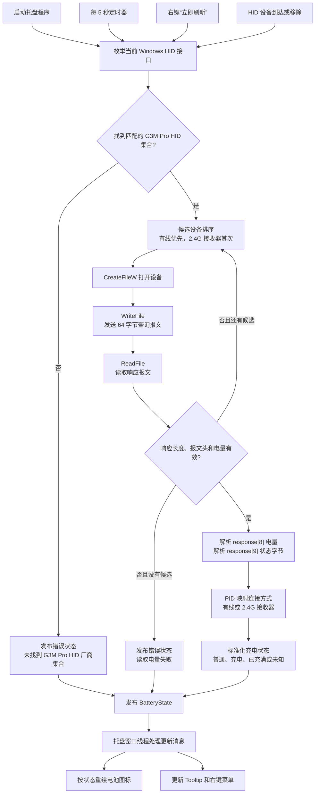

# G3M Pro 电量托盘

一个使用 Go 编写的 Windows 托盘程序，用于实时显示漫步者 G3M Pro 鼠标的电量、连接方式和充电状态。程序直接访问鼠标或 2.4G 接收器暴露的 HID 接口，不需要启动 HECATE Connect，也不需要安装额外的专用驱动。

程序启动后会立即查询一次设备，之后默认每 5 秒查询一次。查询结果会同时反映到托盘图标、鼠标悬停提示和右键菜单中；右键菜单还提供开机启动、立即刷新、退出和当前软件版本。

## 功能

- 支持 USB 有线连接和 2.4G 接收器连接；
- 同时发现两种连接时优先使用有线设备；有线设备读取失败时再尝试其他候选设备；
- 托盘图标根据电量显示绿色、黄色或红色，并在充电时叠加闪电标识；
- 将设备原始状态字节转换为“普通状态”“正在充电”“已充满”和“状态未知”等文字；
- 监听 G3M Pro HID 设备的插入和移除，并在连接变化后立即刷新；
- 电量低于 `20%` 且未处于充电状态时发送一次低电量通知，避免重复打扰；
- 可在右键菜单中切换当前用户的 Windows 开机启动；
- Tooltip 和右键菜单显示电量、连接方式、充电状态及错误信息；
- 通过 Windows 内置 HID、SetupAPI、Shell API 工作，不需要管理员权限。

## 工作原理

### 1. 定位 G3M Pro HID 接口

G3M Pro 会暴露一个厂商自定义 HID 集合。程序使用 Windows SetupAPI 枚举当前存在的 HID 设备接口，然后打开每个候选设备，依次检查 HID 属性、预解析数据和报告能力，只有同时满足以下条件的接口才会被保留：

| 项目 | 值 | 作用 |
| --- | --- | --- |
| Vendor ID | `0x320F` | 识别 HECATE/G3M Pro 设备 |
| Wired Product ID | `0x706B` | 标识有线连接 |
| Receiver Product ID | `0x706E` | 标识 2.4G 接收器 |
| Usage Page | `0xFF1C` | 匹配厂商自定义 HID 页面 |
| Usage | `0x0092` | 匹配电量查询使用的 HID 集合 |
| 输入/输出报告长度 | 至少 64 字节 | 确保能够承载完整查询报文 |

因此，程序不会因为发现普通键盘、鼠标或其他 HID 设备就误把它们当成 G3M Pro。若有多个候选设备，程序按照“有线优先、2.4G 接收器其次”的顺序读取。

### 2. 发送查询并解析响应

对匹配到的 HID 设备，程序通过 `CreateFileW` 打开设备路径，并使用 `WriteFile` 发送固定长度为 64 字节的查询报文。报文前 5 个字节包含当前协议使用的命令，其余字节补零：

```text
04 20 00 1A 06 00 00 00 00 00 00 00 ...
```

随后使用 `ReadFile` 读取设备响应。程序会检查响应长度、报文头和电量范围，避免把不完整或无效的数据更新到托盘。响应字段按照 Go 的 0-based 下标解释如下：

| 响应偏移 | 含义 | 处理方式 |
| --- | --- | --- |
| `response[0]` | 报文类型 | 必须为 `0x04` |
| `response[1]` | 命令族 | 必须为 `0x20` |
| `response[3]` | 子命令 | 必须为 `0x1A` |
| `response[7]` | 数据块标记 | `0xFF` 表示无效数据块 |
| `response[8]` | 电量百分比 | 必须在 `0` 到 `100` 之间 |
| `response[9]` | 原始状态字节 | 由程序转换为用户可读状态 |

当前观察到的状态字节转换规则如下。原始 `flag` 只在内部参与解析，不直接显示给用户：

| 原始状态 | 额外条件 | 托盘显示 |
| --- | --- | --- |
| `0x00` | 无 | 普通状态 |
| `0x02` | 无 | 正在充电 |
| `0x01` | 有线连接且电量低于 `100%` | 正在充电 |
| `0x01` | 有线连接且电量为 `100%` | 已充满 |
| `0x01` | 其他连接方式 | 状态未知 |
| 其他情况 | 包括无法确认的组合 | 状态未知 |

其中 `flag=0x01` 在有线连接下表示充电状态：电量低于 `100%` 时显示“正在充电”，达到 `100%` 时显示“已充满”。其他连接方式下的 `0x01` 含义尚未确认，因此仍显示“状态未知”。

### 3. 状态发布与托盘更新

一次成功查询会形成一个统一的 `BatteryState`，包含电量、连接方式、标准化后的充电状态、更新时间和必要的错误信息。后台监控循环负责查询和发布状态，Windows 托盘窗口线程收到状态更新消息后，重新绘制图标并更新 Tooltip；右键菜单读取同一份状态，因此三处显示保持一致。

除了每 5 秒执行一次的定时轮询，程序还向 Windows 注册 G3M Pro HID 设备接口通知。收到设备到达或移除事件后，程序会复用同一个刷新 channel 重新枚举设备，因此连接接收器、拔出接收器或切换到有线连接时不需要等待下一次定时轮询。

当一次有效查询得到的电量低于 `20%`，且设备没有处于“正在充电”或“已充满”状态时，程序通过托盘通知发送一次低电量提醒。同一轮低电量状态不会每 5 秒重复通知；电量恢复到 `20%` 或以上后，下一次再次降到阈值以下时会重新提醒。



### 4. 开机启动

开机启动默认关闭，用户可以通过右键菜单中的“开机启动”手工开启或关闭。启用后，程序会在当前用户的注册表中写入：

```text
HKEY_CURRENT_USER\Software\Microsoft\Windows\CurrentVersion\Run
    G3MBattery = "C:\path\to\g3m-battery.exe"
```

程序使用当前运行中的 exe 绝对路径作为启动命令，因此不需要安装器或管理员权限。它会在当前用户登录 Windows 后启动，而不是在登录界面之前启动。若移动了 exe 文件，需要重新关闭再开启一次“开机启动”以更新路径。

### 5. 图标和交互状态

- 电量 `50%` 及以上使用绿色填充；`20%` 到 `49%` 使用黄色；低于 `20%` 使用红色；
- 正在充电时在电池图标上绘制白色闪电；
- 未找到设备或读取失败时显示灰色边框和叉号，并在 Tooltip/菜单中保留错误原因；
- 鼠标悬停时显示简短 Tooltip；右键可以查看详细状态、立即刷新或退出程序；
- 轮询和手工刷新使用同一套查询、解析和发布流程，不会产生两种不一致的状态解释。

## 代码结构

| 文件 | 作用 |
| --- | --- |
| `hid_windows.go` | 枚举 HID 接口、筛选设备、发送查询并读取响应 |
| `battery_state_windows.go` | 保存查询结果、映射连接方式和标准化充电状态 |
| `main_windows.go` | 启动托盘、定时轮询并协调刷新消息 |
| `tray_windows.go` | 创建 Windows 隐藏窗口、托盘图标、Tooltip 和右键菜单 |
| `icon_windows.go` | 根据 `BatteryState` 动态绘制电池图标 |
| `startup_windows.go` | 读写当前用户的开机启动注册表项 |
| `version_windows.go` / `VERSION` | 嵌入并显示软件版本号 |
| `logo_windows_*.syso` | 将 `logo.ico` 作为 Windows 程序资源编入不同架构的可执行文件 |

## 构建

项目当前仅支持 Windows，使用 Go `1.25` 或兼容版本。在 Windows 上执行：

```text
go build -trimpath -ldflags="-H=windowsgui" -o g3m-battery.exe .
```

生成的 `g3m-battery.exe` 可以直接运行。程序不需要管理员权限，也不需要安装 HECATE Connect。

GitHub Actions 会在推送符合 `v*.*.*` 格式的标签时自动运行，分别构建 Windows amd64 和 arm64 版本，并将以下产物发布到 GitHub Release：

```text
g3m-battery-windows-amd64.exe
g3m-battery-windows-arm64.exe
```

例如：

```text
git tag v1.2.0
git push origin v1.2.0
```

## 限制

- 这是 Windows 专用程序，源码文件通过 `//go:build windows` 约束为 Windows 构建；
- 程序只识别上面列出的 G3M Pro HID 集合，其他型号或固件版本可能需要重新确认 VID、PID、Usage 或报文字段；
- 当前实现只查询和展示状态，不会修改鼠标配置，也不会控制充电或连接模式；
- 开机启动记录的是当前 exe 路径，移动程序文件后需要重新设置开机启动；
- 状态字节的解释基于当前设备的协议观测结果，遇到新的原始值时会显示“状态未知”，不会静默猜测。
